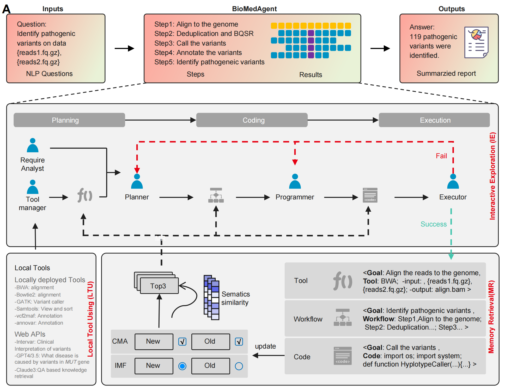
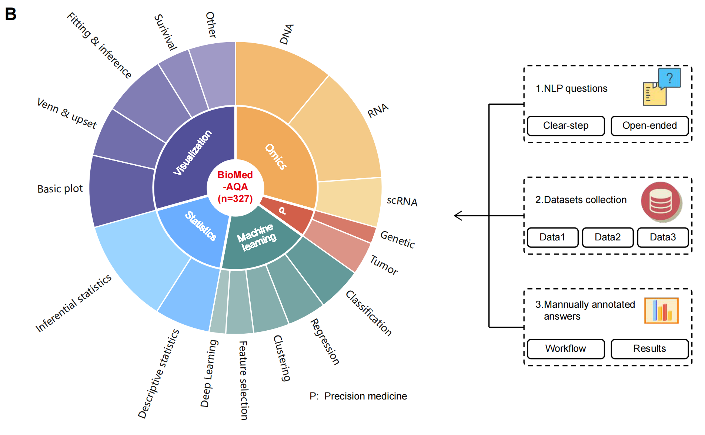

# BioMedAgent：Autonomous Biomedical data Analysis by LLM-powered multi-agents with self-evolving capabilities

## Background
The biomedical field is experiencing a significant expansion in data growth as novel technologies develop, propelled by the vast amounts of medical texts, images, and omics data being collected. Analyzing this data requires complex computational methods that integrates skills from bioinformatics, artificial intelligence, software programming, statistics and mathematics. Various tools and platforms, such as Galaxy and Seven Bridges, provide interfaces for workflow creation and execution, but they face challenges, including reliance on predefined workflows, insufficient support for natural language instructions and lack of summarized readable reports, which restricts intuitive user engagement. Large Language Models (LLMs) have show great advantage in natural language comprehension and demonstrated potential in biomedical data analyses, yet they encounter significant challenges with complex problem planning and low success rate of execution.

Addressing these challenges, we introduce BioMedAgent, an autonomous framework that capitalizes on LLM-powered multi-agents with self-evolving capabilities, incorporating Interactive Exploration (IE) and Memory Retrieval (MR) algorithms. BioMedAgent supports natural language-based task initiation, allowing direct participation from biomedical professionals with no specialized computational or bioinformatics training.

BioMedAgent was tested using the BioMed-AQA bench, comprising 327 manually curated bioinformatic analyses questions across five categories: omics analyses (O), precision medicine support analyses (P), machine learning (M), statistical analyses (S), and data visualization (V). Through the collaborative planning, coding, and execution of multiple agents, it achieved an average success rate of 77%, outperforming two OpenAI web agent applications and a local agent application, each also based on the GPT-4omini LLM. Remarkably, it even surpassed the performance of ChatGPT-4o application using the bigger model, which had a 47% success rate.




## Highlights
We propose BioMedAgent, an autonomous biomedical data analyses framework that firstly utilizes LLM-powered multi-agents with self-evolving capabilities.
- We built the first comprehensive benchmark for evaluating LLM applications in biomedical analyses, BioMed-AQA, spanning five categories of tasks, with natural language questions as analyses instructions and manually annotated answers.
- Extensive experiments demonstrate that BioMedAgent outperforms existing OpenAI agent applications, demonstrating higher success rates across diverse biomedical analyses tasks.
- BioMedAgent supports natural language-based task initiation, allowing direct participation from biomedical professionals with no specialized computational or bioinformatics training.

## Quickstart
### 1. Clone this repo
```
git clone https://github.com/BOBQWERA/BioMedAgent.git
```
### 2. Set up environment
Install python
```
conda create -n BioMedAgent python=3.10
conda activate BioMedAgent
```
Enabling redis（Assuming that redis is already installed on the system）
```
redis-server
```
### 3. Install python requirements
```
cd BioMedAgent
python -m pip install -r requirements.txt
```
### 4. Set environment variables
```
export OPENAI_API_KEY="your_openai_api_key"
```

### 5. Run `demo.py`
You can specify the task type via the task parameter. Demo supports four different task instances of `['machine_learning', 'statistics_t_test', 'statistics_qq_plot', 'visualization_survival_plot', 'visualization_violin_plot', 'omics']`, which can be called via `python demo.py --task task_type`
```
python demo.py --task statistics
```
> For `omics`, you need to deploy the supporting tool `cel2matrix` environment for BioMedAgent call, the tool code and documentation information are provided in the `tool` folder, the code mentioned docker image `biogpt_r` can be downloaded through <a href="https://pan.baidu.com/s/1IebT7S-LwXiIAE1qVJ7vhw?pwd=dcex">Baidu Drive</a>


> For `statistics_t_test` and `statistics_t_test`, you need to deploy the supporting tool `survival_curve` and `t_test` environment for BioMedAgent call, the tool code and documentation information are provided in the `tool` folder, the code mentioned docker image `bio_r` can be downloaded through <a href="https://pan.baidu.com/s/1CzAPNhLp4bJTnEbwABYwCQ?pwd=vwqk">Baidu Drive</a>


## Enrich your tools
You are free to extend the collection of tools to enhance the boundary capabilities of BioMedAgent.
Refer to the `cel2matrix`, `survival_curve` and `t_test` tool information in the `tool` folder, you can configure your local environment to add any tools you want.
Simply complete the documentation as well as the code, and BioMedAgent will automatically perceive the new tool and use it appropriately in new question.
For the BioMedAgent configuration in our paper, its full tool information can be seen in `tool_info.json`.

## Updates
- 2025-02-27: Add the demo of machine learning, statistics, visualization and omics.
- 2025-02-27: Add the demo of survival plot and t-test.